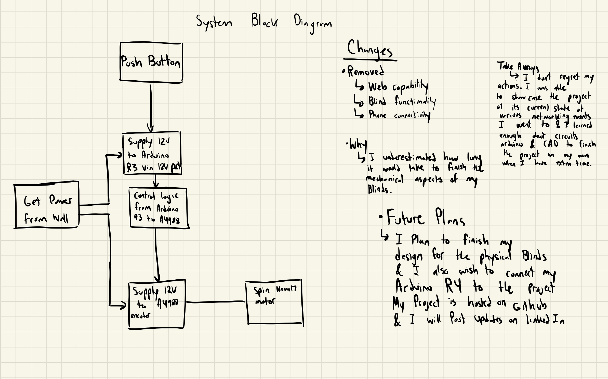
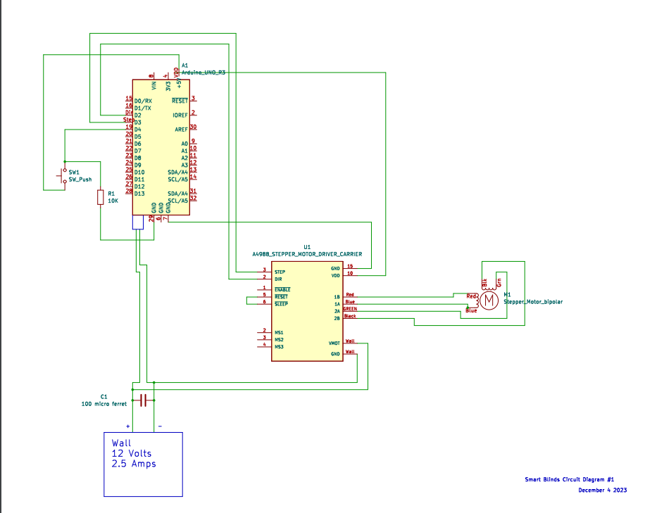
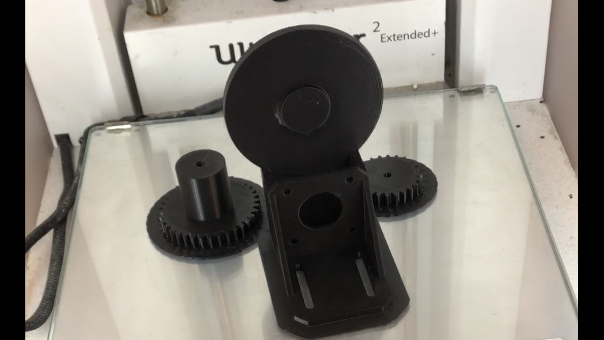
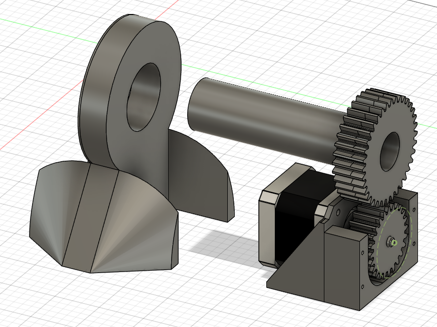
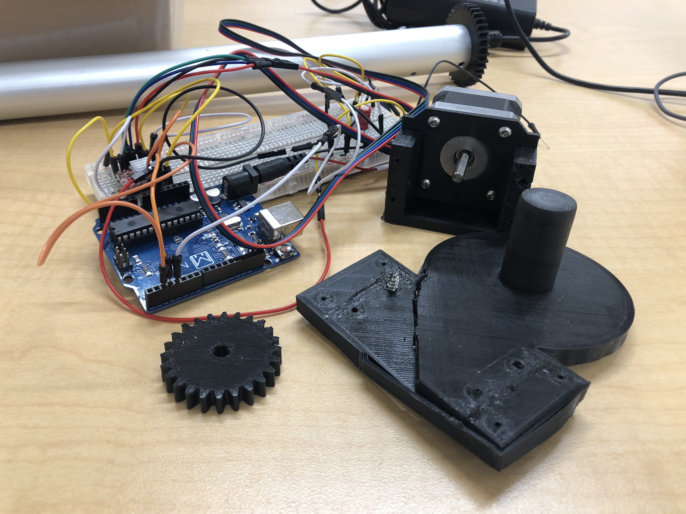

# Smart Blinds
 
Smart blinds is my first project in the world of embedded systems and IOT. It's currently incomplete, and most of the progress on the project is related to Electrical and mechanical problems I tried solving.

# Plans for the future
In the future i plan to Program the arduino R4 to signal the motor to open and close based on the time of day. this can be done by performing a simulation.

# System Diagram

This is the current System Block Diagram for my project so far. I'm gonna update this as time goes on.

 # Circuit Diagram
 
Above is a diagram of the current circuit with the push of a button im able to rotate my motor 360 degrees this action will be the foundation of what my project is capable of doing 

# Failed Prototypes
  

here are some of the failed designs i've made for the blind mechanism to prove im doing stuff!
# Closing thoughts
 Currently the project is in its very early stages the only thing that limits me right now is time! 
